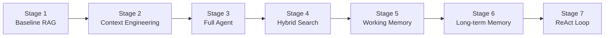

# Context Engineering for LLMs with Redis

Learn to build production-ready AI agents with optimized context management, memory systems, and intelligent retrieval using Redis, LangGraph, and LangChain.

[](https://www.python.org/)
[](https://redis.io/)
[](https://python.langchain.com/)
[](https://opensource.org/licenses/MIT)

---

## What You'll Learn

This hands-on course teaches practical context engineering patterns through building a **Course Advisor Agent**:

- **RAG Fundamentals** — Build retrieval-augmented generation systems with Redis vector search
- **Context Engineering** — Optimize token efficiency using progressive disclosure and hierarchical context
- **LangGraph Agents** — Create observable, stateful workflows with tool calling
- **Hybrid Search** — Combine semantic search with exact-match retrieval using NER
- **Memory Systems** — Implement working memory and long-term memory for personalization
- **ReAct Pattern** — Build agents with explicit reasoning (Thought → Action → Observation)

---

## Prerequisites

| Requirement | Details |
|-------------|---------|
| **Python** | 3.11 or higher |
| **Redis Stack** | Local Docker or [Redis Cloud](https://redis.io/cloud/) |
| **OpenAI API Key** | For GPT-4o access |
| **Agent Memory Server** | For memory stages (5+) |
| **Docker** | For running Redis and Agent Memory Server |

---

## Installation

### 1. Clone the Repository

```bash
git clone https://github.com/redis-developer/context-engineering-reinvent.git
cd context-engineering-reinvent
```

### 2. Create Virtual Environment

```bash
# Using UV (recommended)
curl -LsSf https://astral.sh/uv/install.sh | sh
uv sync

# Or using pip
python -m venv .venv
source .venv/bin/activate  # On Windows: .venv\Scripts\activate
pip install -e .
```

### 3. Set Environment Variables

```bash
# Create .env file
cp .env.example .env

# Edit .env with your values:
OPENAI_API_KEY=sk-your-key-here
REDIS_URL=redis://localhost:6379
AGENT_MEMORY_URL=http://localhost:8088
```

### 4. Start Services

```bash
# Start Redis and Agent Memory Server
docker-compose up -d

# Verify services are running
docker ps
```

### 5. Load Course Data

```bash
# Ingest courses into Redis (required for progressive agents)
uv run python -m redis_context_course.scripts.ingest_courses \
  --catalog src/redis_context_course/data/courses.json --clear
```

### 6. Verify Installation

```bash
# Run tests
uv run pytest tests/ -v

# Or with pip
pytest tests/ -v
```

---

## Quick Start

Try the ReAct agent with visible reasoning in under 2 minutes:

```bash
cd progressive_agents/stage4_react_hybrid_search

# Ask about a course with visible reasoning
python cli.py --show-reasoning "What are the prerequisites for CS002?"
```

**Example output:**
```
🧠 Reasoning Trace:
================================================================================
💭 Thought: The user is asking about prerequisites. I'll use exact match.

🔧 Action: search_courses
   Input: {"query": "CS002", "intent": "PREREQUISITES", "search_strategy": "exact_match"}
👁️  Observation: Found CS002 - Machine Learning Fundamentals...

💭 Thought: I found the course. Prerequisites field is empty - no prerequisites required.

✅ FINISH
================================================================================

📝 Answer:
CS002 (Machine Learning Fundamentals) has no formal prerequisites listed.
```

---

## Project Structure

```
context-engineering-reinvent/
├── src/redis_context_course/     # Core library
│   ├── course_manager.py         # Redis vector search for courses
│   ├── hierarchical_context.py   # Progressive disclosure
│   ├── models.py                 # Pydantic data models
│   └── scripts/                  # Data generation utilities
│
├── progressive_agents/           # 9 agent implementations (learning path)
│   ├── stage1_baseline_rag/
│   ├── stage2_context_engineered/
│   ├── stage3_full_agent_without_memory/
│   ├── stage4_hybrid_search_with_ner/
│   ├── stage4_react_hybrid_search/      # ReAct variant
│   ├── stage5_memory_augmented/
│   ├── stage5_react_memory/             # ReAct variant
│   ├── stage6_longterm_memory/
│   └── stage7_react_loop/               # Full ReAct + memory
│
├── notebooks/                    # 11 Jupyter notebooks
│   ├── section-1-context-engineering-foundations/
│   ├── section-2-retrieved-context-engineering/
│   ├── section-3-memory-systems/
│   └── section-4-tools-and-agents/
│
├── tests/                        # Test suite
├── examples/                     # Usage examples
└── docker-compose.yml            # Redis + Agent Memory Server
```

---

## Progressive Agents

The `progressive_agents/` directory contains a learning path from basic RAG to production-ready agents:



| Stage | Key Feature | What's New |
|-------|-------------|------------|
| **1** | Baseline RAG | Raw JSON context, ~5000 tokens |
| **2** | Context Engineering | Progressive disclosure, ~1000 tokens |
| **3** | Full Agent | LangGraph, intent classification, quality eval |
| **4** | Hybrid Search | NER + FilterQuery for exact course codes |
| **4R** | + ReAct | Visible reasoning trace |
| **5** | Working Memory | Session-based conversation history |
| **5R** | + ReAct | Visible reasoning + memory |
| **6** | Long-term Memory | Cross-session preferences with tools |
| **7** | Full ReAct | Complete: memory + reasoning + tools |

👉 **[See full documentation →](progressive_agents/README.md)**

---

## Notebooks

| Section | Topics | Duration |
|---------|--------|----------|
| **1. Context Engineering Foundations** | What is context engineering, assembly strategies | 2-3 hrs |
| **2. Retrieved Context Engineering** | RAG fundamentals, crafting & optimizing context | 2.5-3 hrs |
| **3. Memory Systems** | Working/long-term memory, compression strategies | 4-5 hrs |
| **4. Tools and Agents** | LangGraph, tool calling, semantic tool selection | 3.5-4.5 hrs |

**Start learning:**
```bash
uv run jupyter notebook notebooks/
```

Open: `section-1-context-engineering-foundations/01_what_is_context_engineering.ipynb`

---

## Key Technologies

| Technology | Purpose |
|------------|---------|
| **Redis Stack** | Vector storage, semantic search, caching |
| **RedisVL** | Vector search library with FilterQuery |
| **LangGraph** | Stateful agent workflows |
| **LangChain** | LLM application framework |
| **Agent Memory Server** | Working and long-term memory management |
| **OpenAI GPT-4o** | Language model for reasoning |

---

## Documentation

| Document | Description |
|----------|-------------|
| [SETUP.md](SETUP.md) | Detailed setup and troubleshooting |
| [progressive_agents/README.md](progressive_agents/README.md) | Agent stages documentation |
| [notebooks/README.md](notebooks/README.md) | Notebook guides |

---

## Contributing

Contributions are welcome! Please read [CONTRIBUTING.md](CONTRIBUTING.md) for guidelines.

---

## License

MIT License — See [LICENSE](LICENSE) for details.
