# Progressive Agents - Context Engineering Learning Path

A progressive learning experience teaching students how to evolve from basic RAG to production-ready agents with memory, using LangGraph-based architecture.

## 🎯 Learning Objectives

Students will learn:

1. **RAG Fundamentals** - Build retrieval-augmented generation systems
2. **Context Engineering** - Optimize token efficiency with progressive disclosure
3. **LangGraph Workflows** - Create observable, stateful agent architectures
4. **Hybrid Search** - Combine semantic and exact-match retrieval
5. **Memory Systems** - Add working and long-term memory for personalization
6. **ReAct Pattern** - Implement explicit reasoning with Thought → Action → Observation loops

## 📚 Stage Overview


| Stage | Directory | Key Feature | Reasoning |
|-------|-----------|-------------|-----------|
| 1 | `stage1_baseline_rag/` | Basic RAG | Hidden |
| 2 | `stage2_context_engineered/` | Progressive disclosure | Hidden |
| 3 | `stage3_full_agent_without_memory/` | LangGraph + quality eval | Hidden |
| 4 | `stage4_hybrid_search/` | Hybrid search + NER | **Visible (ReAct)** |
| 5 | `stage5_working_memory/` | Working memory (session-based) | **Visible (ReAct)** |
| 6 | `stage6_full_memory/` | Working + Long-term memory | **Visible (ReAct)** |

## 🔬 Stage Details

### Stage 1: Baseline RAG
**Problem**: Show that basic retrieval works but is inefficient

```
┌─────────┐     ┌─────────┐     ┌──────────┐
│  Query  │ ──▶ │ Search  │ ──▶ │ Response │
└─────────┘     └─────────┘     └──────────┘
```

**Features**: Raw JSON context, no optimization, ~5000 tokens per query

### Stage 2: Context-Engineered RAG
**Solution**: Apply context engineering from notebooks Section 2

```
┌─────────┐     ┌───────────┐     ┌────────────┐     ┌──────────┐
│  Query  │ ──▶ │  Search   │ ──▶ │ Transform  │ ──▶ │ Response │
└─────────┘     └───────────┘     └────────────┘     └──────────┘
                                         │
                                  Progressive
                                  Disclosure
```

**What's New**: Context transformation, token optimization (~1000 tokens)

### Stage 3: Full Agent
**Enhancement**: Add LangGraph structure, intent classification, quality evaluation


**What's New**: Intent routing, query decomposition, iterative quality improvement

### Stage 4: Hybrid Search with ReAct
**Enhancement**: Named Entity Recognition for precise course code matching + visible reasoning

```mermaid
graph TD
    Q[Query] --> RA[ReAct Agent]

    subgraph ReAct Loop
        RA --> T1[💭 Thought: Analyze query]
        T1 --> A1[🔧 Action: search_courses]
        A1 --> O1[👁️ Observation: Results]
        O1 --> T2[💭 Thought: Evaluate]
        T2 --> |Need more| A1
        T2 --> |Done| F[✅ FINISH]
    end

    F --> R[Response + Reasoning Trace]
```



**What's New**:
- FilterQuery for exact course code matching
- Hierarchical context assembly
- Progressive disclosure based on intent
- Visible reasoning trace with `--show-reasoning` CLI flag

### Stage 5: Working Memory with ReAct
**Enhancement**: Add session-based working memory for multi-turn conversations


**What's New**:
- Agent Memory Server integration for session storage
- Session-based conversation history (within a session)
- Pronoun resolution ("Tell me more about it")
- Auto-extraction to long-term memory (but no explicit tools to query it)

**Tools**: `search_courses` (1 tool)

### Stage 6: Full Memory with ReAct
**Final Stage**: Complete implementation with working + long-term memory

```
User Query
    ↓
┌─────────────────────────────────────────────────────┐
│                   ReAct Loop                         │
│  ┌───────────────────────────────────────────────┐  │
│  │ Thought: Analyze query, plan approach         │  │
│  │ Action: search_courses / remember / recall    │  │
│  │ Observation: Tool results                     │  │
│  └───────────────────────────────────────────────┘  │
│                   ↓ (repeat)                         │
│  ┌───────────────────────────────────────────────┐  │
│  │ Thought: I have enough information            │  │
│  │ Action: FINISH                                │  │
│  │ Action Input: [Final Answer]                  │  │
│  └───────────────────────────────────────────────┘  │
└─────────────────────────────────────────────────────┘
    ↓
Final Response + Reasoning Trace
```

**What's New**:
- `search_memories` tool for querying long-term memory
- `store_memory` tool for saving preferences/facts
- Cross-session personalization
- All previous features + visible reasoning

**Tools**: `search_courses`, `search_memories`, `store_memory` (3 tools)

## 🚀 Quick Start

### Prerequisites

```bash
# Install dependencies
pip install -e .

# Set environment variables
export OPENAI_API_KEY="your-api-key"
export REDIS_URL="redis://localhost:6379"
export AGENT_MEMORY_URL="http://localhost:8088"  # For stages 5+
```

### Running Each Stage

```bash
# Stage 3: Basic agent
cd progressive_agents/stage3_full_agent_without_memory
python cli.py "What courses teach machine learning?"

# Stage 4: Hybrid search with ReAct
cd progressive_agents/stage4_hybrid_search
python cli.py --show-reasoning "What are the prerequisites for CS002?"

# Stage 5: Working memory (session-based) - start Agent Memory Server first
cd progressive_agents/stage5_working_memory
python cli.py --student-id alice --session-id s1 "What is CS004?"
python cli.py --student-id alice --session-id s1 "Tell me more about it"

# Stage 6: Full memory (working + long-term)
cd progressive_agents/stage6_full_memory
python cli.py --student-id alice --show-reasoning "I prefer online courses"
python cli.py --student-id alice --show-reasoning "What courses do you recommend?"
```

### CLI Flags

All stages support these common flags:

| Flag | Description |
|------|-------------|
| `--quiet` / `-q` | Suppress intermediate logging, show only final response |
| `--show-reasoning` | Show agent reasoning trace (stages 4-6) |
| `--student-id <id>` | Student identifier for memory (stages 5-6) |
| `--session-id <id>` | Session identifier for working memory (stages 5-6) |

```bash
# Quiet mode - only shows final response (useful for scripting)
python cli.py --quiet "What is CS004?"
python cli.py -q --student-id alice "What courses are available?"
```

## 📖 Notebook Concepts Demonstrated

| Stage | Notebook Concepts |
|-------|-------------------|
| 1-2 | **Section 2**: RAG fundamentals, context crafting |
| 3 | **Section 4**: LangGraph, tool calling, agent architecture |
| 4 | **Section 2**: Progressive disclosure, hierarchical context + **Section 4**: ReAct pattern |
| 5 | **Section 3**: Working memory, conversation history + ReAct |
| 6 | **Section 3**: Long-term memory, memory extraction + Full ReAct |

### Notebook References

- **Section 1**: Context Engineering Foundations
  - `01_what_is_context_engineering.ipynb`
  - `02_context_assembly_strategies.ipynb`

- **Section 2**: Retrieved Context Engineering
  - `01_rag_fundamentals_and_implementation.ipynb` → Stages 1-2
  - `02_crafting_and_optimizing_context.ipynb` → Stages 2-4

- **Section 3**: Memory Systems
  - `01_working_and_longterm_memory.ipynb` → Stages 5-6
  - `02_combining_memory_with_retrieved_context.ipynb` → Stages 5-6

- **Section 4**: Tools and Agents
  - `01_tools_and_langgraph_fundamentals.ipynb` → All stages
  - `02_building_course_advisor_agent.ipynb` → Stages 3+

## 📊 Feature Comparison

| Feature | S1 | S2 | S3 | S4 | S5 | S6 |
|---------|----|----|----|----|----|----|
| **Context Engineering** | ❌ | ✅ | ✅ | ✅ | ✅ | ✅ |
| **Intent Classification** | ❌ | ❌ | ✅ | ✅ | ✅ | ✅ |
| **Hybrid Search (NER)** | ❌ | ❌ | ❌ | ✅ | ✅ | ✅ |
| **Working Memory** | ❌ | ❌ | ❌ | ❌ | ✅ | ✅ |
| **Long-term Memory** | ❌ | ❌ | ❌ | ❌ | ❌ | ✅ |
| **ReAct (Visible Reasoning)** | ❌ | ❌ | ❌ | ✅ | ✅ | ✅ |
| **Progressive Disclosure** | ❌ | ✅ | ✅ | ✅ | ✅ | ✅ |

*S1=Stage 1, S2=Stage 2, etc.*

## 🔧 Technical Details

### Key Components

| Component | Description | Used In |
|-----------|-------------|---------|
| `CourseManager` | Basic Redis vector search for courses | Stages 1-3 |
| `HierarchicalCourseManager` | Two-tier retrieval (summaries + details) | Stages 4+ |
| `HierarchicalContextAssembler` | Progressive disclosure | Stages 4+ |
| `FilterQuery` | Exact course code matching | Stages 4+ |
| `Agent Memory Server` | Working memory (Stage 5), Full memory (Stage 6) | Stages 5-6 |
| `ReActAgent` | Visible reasoning loop | Stages 4-6 |

**Note:** The workshop modules use `HierarchicalCourseManager` throughout for consistency with the progressive agents.

### Architecture Patterns

1. **Tool-Calling Pattern** (Stage 3): LLM decides when to call tools via `bind_tools()`
2. **ReAct Pattern** (Stages 4-6): Explicit Thought → Action → Observation loop

## 🎓 Learning Outcomes

By completing this progressive path, students will:

1. ✅ **Build RAG systems** from basic to advanced
2. ✅ **Apply context engineering** for token efficiency
3. ✅ **Use LangGraph** for observable agent workflows
4. ✅ **Implement hybrid search** combining NER + semantic search
5. ✅ **Integrate memory systems** for multi-turn conversations
6. ✅ **Understand ReAct** for transparent reasoning

## 📚 Resources

- **Notebooks**: `notebooks/section-1-4/`
- **CourseManager**: `src/redis_context_course/`
- **LangGraph Docs**: https://langchain-ai.github.io/langgraph/

## 📄 License

MIT License

